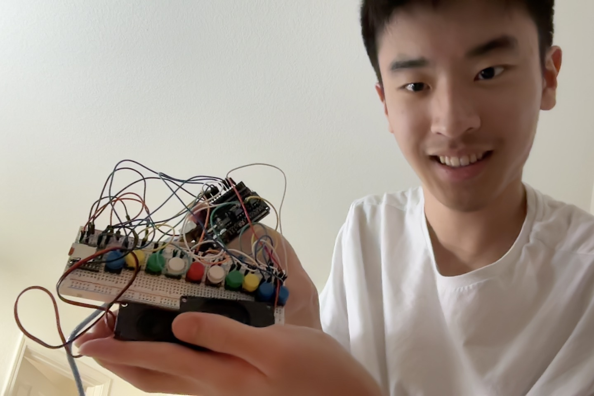
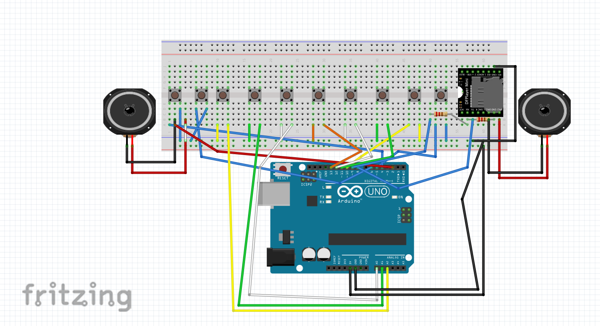

# Button Piano
I created a button piano that bears the most similarities to an actual piano. This, of course, meant incorporating actual pedaling with your feet, as well as modifications like reverb with a speaker. Building the actual piano itself was not the real challenge; rather, the code and trying to mimic the functionality of an actual piano/keyboard, which you would play as an instrument, were the real challenges.

| **Engineer** | **School** | **Area of Interest** | **Grade** |
|:--:|:--:|:--:|:--:|
| Roger Z | Wilcox High School | Electrical Engineering | Incoming Senior


  
# Final Milestone

<iframe width="833" height="500" src="https://www.youtube.com/embed/buvQmXZjCv4" title="Roger Z Final Milestone" frameborder="0" allow="accelerometer; autoplay; clipboard-write; encrypted-media; gyroscope; picture-in-picture; web-share" referrerpolicy="strict-origin-when-cross-origin" allowfullscreen></iframe>

In my final milestone, I was able to install a DFPlayer onto my breadboard. This was by far the biggest challenge, since I had to read a couple articles on what each pin on the player meant, how to wire it properly, how to apply Ohm's law with resisters, and finding the space to plcae it on my single breadboard. In the end, I was able to install my DFPlayer, with the limitation that my piano buttons no longer could play more than 3 sounds at a time. This is due to the tone functions associated with the DFPlayer and the buttons, but I figured it was ok because the DFPlayer can play MP3 files, which have more than 3 frequencies. I then also installed 3 blue buttons; one that adjusts the volume for the DFPlayer alone; one that changes the mp3 file in the DFPlayer; and one that shifts the frequenies of the buttons to play higher notes. I am very happy with my modifications, and my project had transformed into something I love as a pianist myself. After BSE, I hope to develop new projects with my newly gained automacy throughout the BSE experience. 

# Second Milestone

<iframe width="833" height="500" src="https://www.youtube.com/embed/zfSU4IxlW_s" title="Roger Z Milestone 2" frameborder="0" allow="accelerometer; autoplay; clipboard-write; encrypted-media; gyroscope; picture-in-picture; web-share" referrerpolicy="strict-origin-when-cross-origin" allowfullscreen></iframe>

In the first milestone, my instructor and I ordered mini speakers, a SD card, a DFPlayer, and wires to further enhance my project. By implementing speakers instead of piezo buzzers, I figured out that I could produce more robust sounds while not being limited to only one frequency. This meant I was also able to achieve another goal of adding sound effects alongside playing single notes. There is a limit of only being able to play 3 notes at once due to the Arduino Uno kit's limitation, so adding sound effects was a way around that. I was not able to add reverb yet since one of the biggest challenges I had this week was actually getting the DFPlayer installed, and also using an external computer to add mp3 files, since my main computer couldn't detect SD cards. A pedal system is currently being organized, and my code reflects that by this milestone. However, the hardware itself will be shown next week due to new parts coming in (wires not being long enough).

# First Milestone

<iframe width="833" height="500" src="https://www.youtube.com/embed/IZ7pv20wpT0" title="Roger Z Milestone 1" frameborder="0" allow="accelerometer; autoplay; clipboard-write; encrypted-media; gyroscope; picture-in-picture; web-share" referrerpolicy="strict-origin-when-cross-origin" allowfullscreen></iframe>

The button piano base kit consists of mechanical buttons that, when pressed, produce a distinct sound through the Arduino Uno Board that can be modified inside the Arduino IDE. Right now, not all of the code can be shown physically working, due to the temporary use of a passive buzzer instead of a piezo buzzer. A piezo buzzer uses something called the piezoelectric effect, which uses crystals to generate an electric charge that will cause sound to play. A piezo buzzer has been ordered so you will hopefully see a piezo buzzer working in other milestone videos. I also asked my instructor to order mini speakers that will allow me to add reverb, and maybe even turn my button piano into some kind of soundboard in the future. In my second milestone, I hope to code more functionality to my button piano like reverb, be able to assemble a well-designed breadboard, and debug as much of the code as possible. 

# Schematics 



# Code

```c++
#include <AltSoftSerial.h>
#include <DFRobotDFPlayerMini.h>

// NOTE FREQUENCIES
const int NUM_KEYS = 7;
const int INPUT_BUTTON_PINS[NUM_KEYS] = {10, 11, 12, 13, A0, A1, A2};

// Mode 1: C, C#, D, D#, E, F, F#
const int MODE1_NOTES[NUM_KEYS] = {262, 277, 294, 311, 330, 349, 370};
const char* MODE1_NAMES[NUM_KEYS] = {"C", "C#", "D", "D#", "E", "F", "F#"};

// Mode 2: G, G#, A, A#, B, C, C#
const int MODE2_NOTES[NUM_KEYS] = {392, 415, 440, 466, 494, 523, 554};
const char* MODE2_NAMES[NUM_KEYS] = {"G", "G#", "A", "A#", "B", "C", "C#"};

// PIN DEFINITIONS
const int SPEAKER_PIN = 2;
const int VOLUME_BUTTON_PIN = 6;
const int SFX_BUTTON_PIN = 5;
const int MODE_SWITCH_BUTTON_PIN = 4;

// STATE VARIABLES
int volumeLevels[6] = {5, 10, 15, 20, 25, 30};
int currentVolumeIndex = 3;
int currentSoundIndex = 1;

bool sharpMode = false;

bool keyPressed[NUM_KEYS] = {false};
bool keyPreviouslyPressed[NUM_KEYS] = {false};
int currentlyPlayingNote = -1;

bool lastVolumeButtonState = HIGH;
bool lastSfxButtonState = HIGH;
bool lastModeButtonState = HIGH;

// DFPlayer
AltSoftSerial mySerial;
DFRobotDFPlayerMini myDFPlayer;

void setup() {
  Serial.begin(9600);
  Serial.println("Starting Piano + DFPlayer...");

  // Piano buttons
  for (int i = 0; i < NUM_KEYS; i++) {
    pinMode(INPUT_BUTTON_PINS[i], INPUT_PULLUP);
  }

  // Control buttons
  pinMode(VOLUME_BUTTON_PIN, INPUT_PULLUP);
  pinMode(SFX_BUTTON_PIN, INPUT_PULLUP);
  pinMode(MODE_SWITCH_BUTTON_PIN, INPUT_PULLUP);

  // DFPlayer
  mySerial.begin(9600);
  if (!myDFPlayer.begin(mySerial)) {
    Serial.println("❌ DFPlayer Mini not detected!");
    while (true);
  }

  Serial.println("✅ DFPlayer Mini ready!");
  myDFPlayer.volume(volumeLevels[currentVolumeIndex]);
  myDFPlayer.play(1);
  delay(1000);
}

void loop() {
  // Volume Button
  bool volumeButtonState = digitalRead(VOLUME_BUTTON_PIN);
  if (volumeButtonState == LOW && lastVolumeButtonState == HIGH) {
    currentVolumeIndex = (currentVolumeIndex + 1) % 6;
    myDFPlayer.volume(volumeLevels[currentVolumeIndex]);
    Serial.print("🔊 Volume set to: ");
    Serial.println(volumeLevels[currentVolumeIndex]);
    delay(200);  // debounce
  }
  lastVolumeButtonState = volumeButtonState;

  // Sound FX Button
  bool sfxButtonState = digitalRead(SFX_BUTTON_PIN);
  if (sfxButtonState == LOW && lastSfxButtonState == HIGH) {
    currentSoundIndex++;
    if (currentSoundIndex > 5) currentSoundIndex = 1;
    myDFPlayer.play(currentSoundIndex);
    Serial.print("🎵 Playing SFX: ");
    Serial.println(currentSoundIndex);
    delay(200);  // debounce
  }
  lastSfxButtonState = sfxButtonState;

  // Mode Switch Button
  bool modeButtonState = digitalRead(MODE_SWITCH_BUTTON_PIN);
  if (modeButtonState == LOW && lastModeButtonState == HIGH) {
    sharpMode = !sharpMode;
    Serial.print("🔁 Switched to mode: ");
    Serial.println(sharpMode ? "2 (G to C#)" : "1 (C to F#)");
    delay(200);  // debounce
  }
  lastModeButtonState = modeButtonState;

  // Read Piano Button States
  for (int i = 0; i < NUM_KEYS; i++) {
    keyPressed[i] = (digitalRead(INPUT_BUTTON_PINS[i]) == LOW);
  }

  // Play new note
  for (int i = 0; i < NUM_KEYS; i++) {
    if (keyPressed[i] && !keyPreviouslyPressed[i]) {
      if (currentlyPlayingNote != -1) {
        noTone(SPEAKER_PIN);
      }
      int freq = sharpMode ? MODE2_NOTES[i] : MODE1_NOTES[i];
      tone(SPEAKER_PIN, freq);
      currentlyPlayingNote = i;
      break;
    }
  }

  // Stop tone if no buttons held
  bool anyHeld = false;
  for (int i = 0; i < NUM_KEYS; i++) {
    if (keyPressed[i]) {
      anyHeld = true;
      break;
    }
  }

  if (!anyHeld && currentlyPlayingNote != -1) {
    noTone(SPEAKER_PIN);
    currentlyPlayingNote = -1;
  }

  // Save previous button states
  for (int i = 0; i < NUM_KEYS; i++) {
    keyPreviouslyPressed[i] = keyPressed[i];
  }

  // Serial Debug Output
  Serial.print("Note: ");
  if (currentlyPlayingNote != -1) {
    Serial.print(sharpMode ? MODE2_NAMES[currentlyPlayingNote] : MODE1_NAMES[currentlyPlayingNote]);
  } else {
    Serial.print("None");
  }

  Serial.print(" | Volume: ");
  Serial.print(volumeLevels[currentVolumeIndex]);

  Serial.print(" | SFX: ");
  Serial.print(currentSoundIndex);

  Serial.print(" | Mode: ");
  Serial.println(sharpMode ? "2" : "1");

  delay(20);
}

```

# Bill of Materials

| **Part** | **Note** | **Price** | **Link** |
|:--:|:--:|:--:|:--:|
| Arudino Uno R3 Kit | Super Starter Kit with a ton of different projects for modifications | $44.99 | <a href="https://www.amazon.com/ELEGOO-Project-Tutorial-Controller-Projects/dp/B01D8KOZF4/ref=sr_1_4?crid=1XZ687M5D3ZD7&dib=eyJ2IjoiMSJ9.-TMWe7jTY1L2k9FBx9xn4w0XaflU8V_pGx85CZStFn6a-TH39OcB3AGzWNf1EIKw2NMgmEaYxpeY4ciYOp9QPCkKkCHXzB47RzVfKVwctCAOcXjByS5fDtVU5eKf3uCaofFvxa3UklTDqup5O4yWXeSDefi-Kfmv3K6g6nDa4S2vd3YAFmKNxfpSLBu9JAdQz3IXb7qYzNyoGiMc98SLmd33BsMJO-Z92GizCC3e4Rw.sEr7nXWiJ-3djacq_uV2qAdWY1JvlsT99KX0mtxhk88&dib_tag=se&keywords=arduino+uno+r3+kit+elegoo&qid=1753466503&sprefix=arduino+uno+r3+kit+elego%2Caps%2C135&sr=8-4"> Amazon </a> |
| Piezo Buzzers | Used for playing single sounds | ~$2.99 | <a href="[https://www.amazon.com/Arduino-A000066-ARDUINO-UNO-R3/dp/B008GRTSV6/](https://www.mouser.com/ProductDetail/810-PS1240P02BT)"> Mouser </a> |
| Mini Speakers | To play sounds with mulitple frequencies | $9.99 | <a href="[https://www.amazon.com/Arduino-A000066-ARDUINO-UNO-R3/dp/B008GRTSV6/](https://www.amazon.com/DWEII-Loundspeaker-Compatible-Motherboard-Electronic/dp/B0CX1JC6NM/ref=sr_1_6?dib=eyJ2IjoiMSJ9.FxuzjXkPr41Aq06cVivzUVbcdF02OCQ7zj6Qp5f9eUu8EOjog1hLbHKjpiKcn9ihbq8pn76O3Gs1SSOTF3SPQcJ9L9aGRX73-WXqedMsdCXwlxG_fhzmY69Z4nNKLvvfB7I3ZxqqB5QpCcc_wQ7-alFywmWmQyoRdJ4UPqEWAB1ST8luDP216h4BBxBqT1-RfoVR2rPWeaF2Y9IYfFq-dQm-vwrxPLc9FurQmR667dQ.3I3pIVf3-VIr0d91z6pWo4yzpadQWMJ-sSDKhE35ACQ&dib_tag=se&keywords=arduino%2Bspeaker&qid=1752093872&sr=8-6&th=1)"> Amazon </a> |
| DFPlayer Mini | Converts mp3 files to be played with features | $9.99 | <a href="https://www.amazon.com/DFPlayer-A-Mini-MP3-Player/dp/B089D5NLW1/ref=sr_1_4?crid=3UIQER0PZFEPQ&dib=eyJ2IjoiMSJ9.YrXsgIIjUaSsAEXykz_XhQppXDKwD0Dfh_PnkcaT0uEPjTvv6mrKIKSqi56OUQrLUL3XMdn6QHdXY7llWivVycKz2FlFarF5nWp_f4wbRtPpQGutaF3KkJWWZ2fdMN3zJOudlrx4l-4sc_3UGKbCA1teHU-ue7xKwxZ_3p4XxJCN22r7n9ZoBUztJ4_IZV_mJWgQzSgu1lJUr_c3SlwpKIFvtlyz65HHg0sy6XcpXak.i1qKCcSgZBrjwgcsrZnVCrhxh8GrqJO_lfo3oLdVpk4&dib_tag=se&keywords=DFPlayer+mini&qid=1753498237&sprefix=dfplayer+min%2Caps%2C147&sr=8-4"> Amazon </a> |
| Micro SD Cards | Store mp3 files in | $15.99 | <a href="https://www.amazon.com/Lexar-Micro-microSDXC-Memory-Adapter/dp/B09JNKHJ2Q/ref=sr_1_3?crid=2ATR7QR98NZT9&dib=eyJ2IjoiMSJ9.r9uGNZ9n35tnVXT1xRj81jbNisjOCOIUxdxTNc5bVMj8r0jmJBs7MI4-bXBtB-q1hiO-dBgWcrZ5TsK9txJbGl87eFpMlCNbZp35ovL0_ekuFUpMQ-ilBa5hdIblRD0Ti-qwiIuZiawrAl0jXCFNVQ_vUd5d-TrbAHbmBlPsseStJNzT1Jd_4IIVTJQ_T_Bo6_hbEBNG-FknWgJVKe1D4cHehEZjRSqpwS987KQKPzg.S9mUZfyTV9SU7Xr-0CV9wr7NwZv970kl93r56SC87bo&dib_tag=se&keywords=lexar+64gb+sd+cards+micro&qid=1753498347&sprefix=lexar+64gb+sd+cards+mic%2Caps%2C120&sr=8-3"> Amazon </a> |
